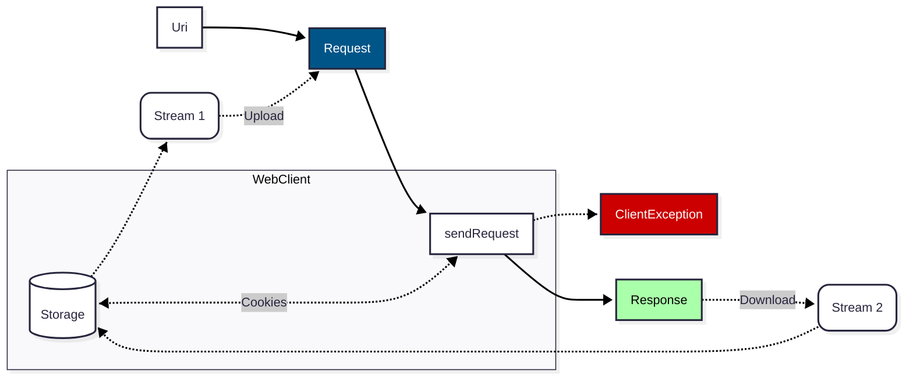

# PHP standard web client

## PHP Standard Recommendations

[PHP-FIG](https://www.php-fig.org/) is: the PHP Interop Group.
It proposes (RFC) and defines PHP Standard Recommendations (PSR).
See: https://www.php-fig.org/psr/

Here are the few PSR dealt in this document:

* [PSR-3 = Logger interface](https://www.php-fig.org/psr/psr-3/)
* [PSR-7 = HTTP Message interface](https://www.php-fig.org/psr/psr-7)
* [PSR-18 = HTTP Client interfaces](https://www.php-fig.org/psr/psr-18)

## Installation

You may have first to [install PHP Composer](https://getcomposer.org/download/).

Then, you will have to clone or download this repository (see clone button).

And finally, you will have to run the following command line:

`$ cd path/to/psr-web-client && composer update`

## Diagram



**Storage** can either be:

* Memory if we use simple **MemoryStream class**
* Disk if we use **FileStream class** for upload(s) and/or download(s)

## Our implementation of PSR-18

Respecting [PSR-7 interfaces](https://github.com/php-fig/http-message/tree/master/src)
and [PSR-18 interfaces](https://github.com/php-fig/http-client/tree/master/src),
[several HTTP classes](../../php/Http/) were implemented in this chronological order:

1. Logger,
2. Response,
3. Uri,
4. MemoryStream (light and easy cases),
5. Request,
6. Client,
7. FileStream (work in progress)

### Use cases

Simple (GET) example:

```php
$webClient = new \Http\Client; // init web client
$request = new \Http\Request(new \Http\Uri($url)); // create the HTTP request
$response = $webClient->sendRequest($request); // <-- Exec the request. May throw ClientException

$data = $response->jsonDecode(); // It's a kind of magic...! But it may throw an exception
forEach ($data->records as $record) {
	// process each record
}
```

Here is a more complex example:

```php
$webClient = new \Http\Client; // init web client
$webContextArr = [ // as options in: https://www.php.net/manual/en/function.stream-context-create.php
	'header' => [$headerStr], // custom HTTP request header(s)
	'timeout' => 5, // timeout in seconds
	'method' => $method,
];

$uri = new \Http\Uri($url); // Convert URL string to Uri object
$request = new \Http\Request($uri, $webContextArr); // create the HTTP request
if (isSet($dataToSend) && is_string($dataToSend) && trim($dataToSend)!=='') {
	$request = $request->withBody($dataToSend); // Can be a file to upload instead of a string (soon)
}

$response = $webClient->sendRequest($request); // <-- Exec the request. May throw ClientException

$data = $response->jsonDecode(); // It's a kind of magic...! But it may throw an exception
forEach ($data->records as $record) {
	// process each record
}
```

See also [PHP manual about stream context](https://www.php.net/manual/en/function.stream-context-create.php)

This kind of implementation can support very complex web requests
such as sending big binary files (ZIP for examples)
and also download big files as the response.
It may also support even more complex HTTP requests such as **video streaming**.

## Bug reports

If you find any bug, please report it by creating an issue here. Pull requests are welcomed.
